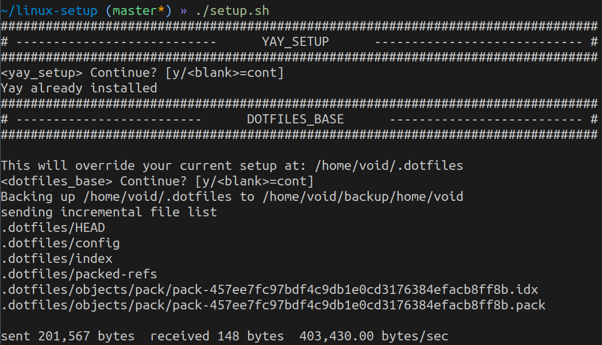

# linux-setup

Collection of scripts to automatically install and configure my favourite software.

### Quick start
Just directly pipe the main `setup.sh` script, and follow all steps.
```bash
curl https://raw.githubusercontent.com/tsepanx/linux-setup/master/curl.sh | bash
```

### Script interaction
A script will ask to continue on each `<section>`, responsible for a single util setup.
On waiting an answer from user, any other from `y` or empty input %%any other than `yes`, %%will be considered as section skip.



### Sections

#### Packages installation
My packages lists at `pkg-lists/` installation.
1) Choose whether to install whole `base` list
2) Choose specific packages from `extra` list
3) Choose left lists to install as a whole

#### Yay
Setup `yay`, using `git.io/yay.sh` script

#### My Dotfiles
git clones [my dotfiles repo](https://github.com/tsepanx/dotfiles) to `~/.dotfiles` as bare repository.

#### Zsh
- my shell-related config files.
    - `.bashrc`
    - `.zshrc`
    - `.alias_zsh`
    - `.alias_bash`
    - `.vars`
- `oh-my-zsh`, with plugins
    - `zsh-autosuggestions`
    - `zsh-syntax-highlighting`

#### Neovim
- my `.vimrc` config linked by `init.vim`
- Install plugins

#### Ranger
- my config files at `.config/ranger`
- fresh plugins repos
    - `fzf_select`
    - `ranger_devicons`
    - `ranger-zoxide`


### TODO
- Cp files from `./root` dir
- `systemctl enable --now --user mpd.socket`
